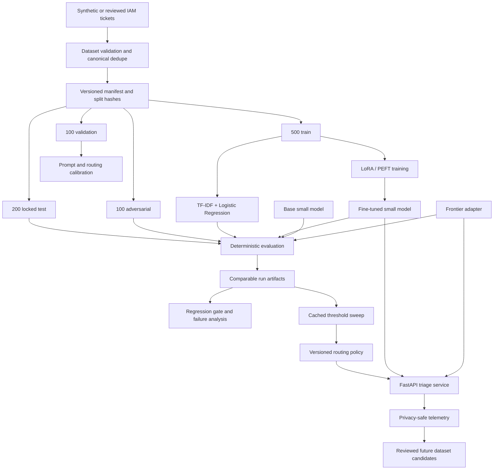

# Architecture

## Why this shape

ModelForge is a modular monolith. The experiment needs strong boundaries
between data, models, evaluation, and routing, but it does not need distributed
services. Python protocols make model/provider changes testable; Pydantic makes
the IAM contract explicit; immutable files make a small project reproducible.

## Component boundaries

### Schemas

`modelforge.schemas` owns the ticket, label, prediction, dataset, and manifest
contracts. Closed enums make invalid labels fail immediately. Evidence grounding
needs both the prediction and original ticket, so the Hugging Face and frontier
adapters enforce it before returning a prediction; evaluation measures it again
for cached/adapter-independent outputs, and routing retains a hard-failure check
for any other model implementation.

Alternative: loose dictionaries are shorter initially but push errors into
training, metrics, and production. A single strict contract is cheaper overall.

### Dataset pipeline

`modelforge.datasets` normalizes only for fingerprinting; it preserves the
original ticket text for evidence checks. It validates every row before atomic
writes, rejects conflicting labels, checks cross-split exact leakage, records
provenance, and verifies the untouched-test digest.

The v1 data is synthetic. That makes the repository safe and reproducible, not
production-representative. Real de-identified tickets must become a new dataset
version with a separate review record.

### Models and training

All runtimes implement one async `TriageModel` contract and return a validated
prediction plus operational metadata. Classical, Hugging Face, frontier, and
demo adapters do not get special evaluator paths. The two generative adapters
reject schema-valid but non-literal evidence as a typed model-output failure at
the adapter boundary.

Training keeps the base revision immutable and writes a PEFT adapter. The loss
is masked over prompt tokens so only the target JSON completion is supervised.
The code retains tokenizer, batching, optimizer, learning-rate, loss, epoch,
checkpoint, LoRA rank, trainable-count, accumulation, precision, and overfitting
information in a run manifest.

Alternative: full fine-tuning may improve quality but costs more to train,
store, serve, and roll back. It is a later controlled experiment if LoRA cannot
clear quality floors.

### Evaluation

Deterministic evaluators own JSON/schema validity, exact labels, F1, confusion,
routing/severity/action/scope accuracy, and literal evidence grounding. An
optional judge is deliberately narrow: semantic evidence relevance and
unsupported implications. Human review validates the judge rather than assuming
it is correct.

Runtime/provider errors have their own denominator. They are not converted into
wrong answers or allowed to disappear from reliability reporting.

### Routing

The small model always runs first. An inspectable uncertainty assessment decides
whether to return it or call the frontier adapter. The score is explicitly not
a probability. Structural/evidence failures force escalation; ambiguity can
cap the score; optional logprob and repeated-sample agreement remain visible.

The threshold comes from a versioned validation artifact. A request that needs
escalation fails explicitly if the frontier is unavailable. Silently returning
an untrusted small-model answer would make downstream automation unsafe.

### API and telemetry

FastAPI exposes typed endpoints from one process. Model loading is lazy,
evaluation concurrency is bounded, request bodies are bounded even when
chunked, and provider calls have deadlines. Logs and telemetry store operational
metadata only; ticket bodies and evidence are excluded.

The JSONL telemetry sink is a development implementation. Its interface can be
replaced with a durable sink when multi-worker deployment is justified.

## Artifact identity

An empirical claim is comparable only when these identities match or the
difference is intentional and recorded:

- dataset version, split digest, and manifest digest;
- prompt text/hash and schema version;
- base model and tokenizer revision;
- adapter/config hash and training seed;
- generation parameters;
- evaluator and judge/rubric versions;
- code commit and dependency versions;
- hardware/precision for latency and memory claims;
- pricing source/effective date and workload assumptions for cost claims.

## Key interview questions

- Why can a high aggregate F1 still be unsafe to ship?
- Why is validation data appropriate for routing calibration but test data is
  not?
- Why is self-reported confidence not calibrated probability?
- Why does sequential fallback change p95 latency more than average latency?
- Why mask prompt tokens during causal-language-model supervised fine-tuning?
- When should an LLM judge be replaced by a deterministic evaluator?
- What evidence would justify moving from a modular monolith to a queue or
  distributed service?
