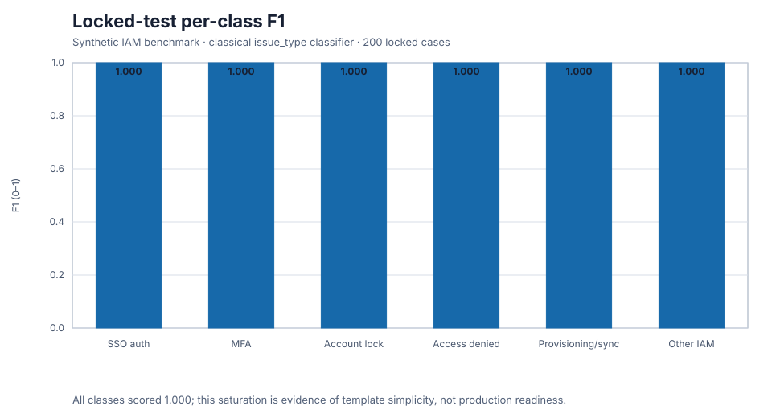
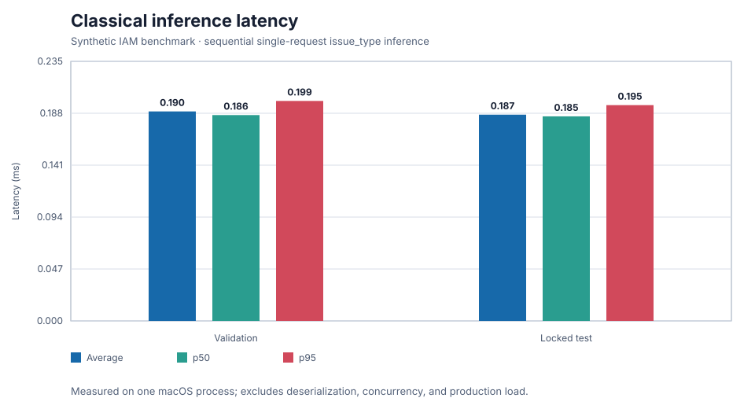
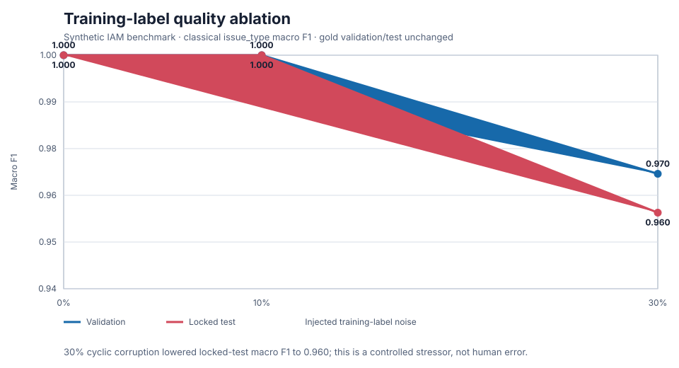

# Experiments and evidence

## Decision question

The target decision is whether a LoRA-tuned small open-weight model can handle
most IAM triage requests above declared quality floors while selective frontier
fallback improves the quality/cost tradeoff. The repository does not yet have
enough empirical evidence to make that decision.

## Experiment matrix

| ID | Hypothesis | Required evidence | Status |
|---|---|---|---|
| E0a | Sparse lexical features establish the minimum useful `issue_type` baseline | Validation + locked-test classification metrics, latency, configuration, hashes | **Measured** |
| E0b | Held-out issue classification degrades as training labels become less reliable | Deterministic corruption plans and validation/locked-test metrics at declared noise levels | **Measured** |
| E1 | Qwen2.5 0.5B Instruct can emit useful full IAM records without adaptation | Full-record validation/test/adversarial report | **Not run** |
| E2 | Completion-only LoRA improves E1 without unacceptable overfitting or resource cost | Immutable training manifest, adapter, validation loss, parity and full evaluation | **Not run** |
| E3 | A configured frontier model supplies a defensible comparison/fallback | Versioned provider/model/prompt/pricing identity and full evaluation | **Not run** |
| E4 | Selective routing preserves floors with fewer frontier calls | Cached paired validation outputs, threshold sweep, locked policy, final test report | **Not run** |
| E5 | A narrow evidence judge is reliable enough for its semantic role | Human reviews plus agreement/error analysis | **Not run** |

“Not run” means there is no committed machine-readable result. Adapter code,
tests, configuration, or a development policy do not fill that cell.

The [Qwen LoRA evidence runbook](qwen-lora-runbook.md) defines the pre-run,
training, evaluation, archiving, and serving sequence for E1/E2. It does not
authorize a model download or turn configured code into measured evidence.

## E0a: measured classical baseline

Artifact:
[`experiments/results/classical_tfidf_logreg_v1.json`](../experiments/results/classical_tfidf_logreg_v1.json)

Configuration:

- word unigram/bigram TF-IDF, maximum 20,000 features;
- class-balanced logistic regression;
- `random_state=20260820`, `max_iter=1000`;
- 500 training examples;
- predicts `issue_type` only.

Measured environment: Python 3.13.7, scikit-learn 1.9.0, NumPy 2.5.2,
macOS 15.3.2 arm64.

| Population | Cases | Accuracy | Macro precision | Macro recall | Macro F1 | Avg latency | p50 | p95 |
|---|---:|---:|---:|---:|---:|---:|---:|---:|
| Validation | 100 | 1.0000 | 1.0000 | 1.0000 | 1.0000 | 0.1896 ms | 0.1863 ms | 0.1991 ms |
| Locked test | 200 | 1.0000 | 1.0000 | 1.0000 | 1.0000 | 0.1867 ms | 0.1852 ms | 0.1953 ms |





Every one of the six issue classes has per-class F1 of 1.0 in both reported
populations. Fit time was 0.9800 seconds. Estimated variable cost is zero for
the local classifier. Raw process peak RSS was 195,477,504 bytes on macOS; that
value includes the process and is not model-only memory.

### Interpretation

E0a shows that the current generated issue-type task is lexically separable. It
does not show that real tickets are easy, that a generative model is useful, or
that the full output is correct. The runner does not score routing team,
severity, affected scope, action, evidence, schema reliability, or the
adversarial split. The very high score reduces confidence that absolute v1
metrics will transfer to production.

## E0b: measured training-label-quality ablation

Artifact:
[`experiments/results/classical_label_quality_ablation_v1.json`](../experiments/results/classical_label_quality_ablation_v1.json)

Hypothesis: held-out issue classification should degrade as training labels
become less reliable.

For each declared fraction, the runner chooses an exact seeded subset of the
500 training rows and replaces each selected `issue_type` with the next allowed
class in enum order. The base seed is `20260820`; the runner uses a deterministic
seed offset for each point, so the selected subsets are reproducible but are
not a nested corruption ladder. Validation and locked-test labels remain
unchanged. Each point fits the same TF-IDF/logistic-regression model family from
scratch. Artifact schema 1.1 records each split's total misclassification count
and up to ten examples sorted by case ID. Examples contain only case ID,
expected issue type, and predicted issue type; ticket text is excluded.

| Injected training-label noise | Corrupted labels | Validation macro F1 | Validation errors | Locked-test macro F1 | Test errors |
|---:|---:|---:|---:|---:|---:|
| 0% | 0/500 | 1.000000 | 0 | 1.000000 | 0 |
| 10% | 50/500 | 1.000000 | 0 | 1.000000 | 0 |
| 30% | 150/500 | 0.969529 | 3 | 0.959549 | 8 |



At 30% noise, validation accuracy was 0.9700 and locked-test accuracy was
0.9600. Test macro F1 fell by 0.040451 from the clean 1.000000 result to
0.959549, supporting the directional hypothesis at the largest stress level.
Ten percent noise caused no measured change. All three validation and eight
test failures fit below the per-split example cap and are therefore present in
the artifact; [Failure analysis](failure-analysis.md) lists them.

### Conclusion and caveats

Label quality mattered under the largest controlled perturbation, but the
result is not evidence about LLM training, generation, evidence extraction, or
routing. The shallow degradation—and complete resistance at 10%—also exposes
the synthetic templates' unusually strong lexical cues.

The corruption mechanism is deliberately narrow: it rotates labels to one
specific wrong class rather than reproducing human ambiguity, inconsistent
severity policy, missing annotations, correlated annotator errors, or input
distribution shift. The per-level subsets use distinct deterministic seeds and
are not guaranteed to contain one another. The ablation evaluates only
`issue_type`; it says nothing about the other structured fields or the
adversarial population.

## Configured but unrun work

### E1/E2: base and LoRA small model

[`qwen_lora_r16_v1.yaml`](../experiments/configs/qwen_lora_r16_v1.yaml)
declares `Qwen/Qwen2.5-0.5B-Instruct`, three epochs, rank-16 LoRA, completion-only
supervision, the explicit `adamw_torch` optimizer, validation loss,
checkpointing, early stopping, and deterministic seeds. The training
implementation records resolved model/tokenizer revisions, dataset and prompt
hashes, parameter counts, hardware/precision, packages, losses, overfitting
diagnostics, truncation counts, and artifact hashes.

There is no `experiments/runs/qwen_lora_r16_v1` artifact in the repository, so
no claims about loss, quality, speed, memory, or trainable parameter count are
made.

### E3: frontier baseline

The provider-neutral adapter supports an OpenAI-compatible
`/chat/completions` endpoint, strict output parsing, injected fake clients,
literal evidence enforcement before returning a prediction, deadlines,
sanitized errors, token usage, and explicitly supplied token prices. No
provider/model identity or prediction artifact is committed. Default zero prices
mean “not configured,” not free inference.

### E4: routing

[`routing_policy_v1.json`](../experiments/results/routing_policy_v1.json) contains
threshold `0.85`, `status: uncalibrated`, frontier identity
`unconfigured-frontier`, and no validation run. It is a development default.
It is not evidence that 0.85 is optimal or safe.

The routing sweep implementation and unit fixtures exercise fixed thresholds,
population weights, sequential latency, cost, slices, and overconfident errors.
Those fixtures are software tests, not empirical model results.

## Reproduction commands

Install core and development dependencies:

```bash
python3 -m venv .venv
source .venv/bin/activate
python -m pip install --upgrade pip
python -m pip install -e '.[dev]'
```

Run the measured baseline into new artifact paths:

```bash
python -m modelforge.experiments.run_classical \
  --output /tmp/modelforge-classical-result.json \
  --model-output /tmp/modelforge-classical-model.joblib
```

Re-run the measured label-quality ablation into a new path:

```bash
python -m modelforge.experiments.run_data_ablation \
  --noise-fractions 0 0.1 0.3 \
  --seed 20260820 \
  --output /tmp/modelforge-label-quality-ablation.json
```

Install the optional training stack and launch the configured LoRA experiment:

```bash
python -m pip install -e '.[train,dev]'
modelforge-train \
  --config experiments/configs/qwen_lora_r16_v1.yaml \
  --project-root .
```

The training command requires network/model access unless the model is already
cached. It creates an immutable run directory and refuses to reuse an existing
experiment name. It has not been executed into committed evidence.

## Protocol for completing the hypothesis

1. Resolve and record immutable base-model and tokenizer commits.
2. Run E1 on validation; debug only with validation and harness cases.
3. Run E2 under a new experiment name and retain the full manifest and adapter.
4. Configure E3 with a pinned provider/model identity, current dated pricing,
   data-handling approval, and a hard deadline.
5. Cache paired E2/E3 validation predictions. Never regenerate per threshold.
6. Sweep the declared thresholds and choose a policy against predeclared
   aggregate, class, slice, latency, cost, and overconfident-error constraints.
7. Lock the calibrated policy with its validation run ID.
8. Evaluate fixed E1/E2/E3/E4 candidates on the hash-locked test and report the
   adversarial population separately.
9. Run the comparability check and regression gate before promotion.
10. Repeat on a new privacy-reviewed, de-identified, human-annotated dataset
    version before any production-readiness claim.

## Decision criteria still missing

The project intentionally does not invent numerical release floors. Before the
final experiment, owners must declare at least:

- maximum runtime error and schema-invalid rates;
- minimum aggregate and per-class issue F1;
- minimum severity/routing/scope/action accuracy;
- minimum evidence presence and grounding, and maximum unsupported evidence;
- adversarial-slice floors;
- maximum p95 latency under a declared load profile;
- dated token prices, request-volume assumptions, and self-hosted fixed-cost
  assumptions;
- maximum frontier share and overconfident errors per 100 requests.

Without those predeclared constraints, a “best” routing threshold can be chosen
after seeing results and is not a defensible decision.
